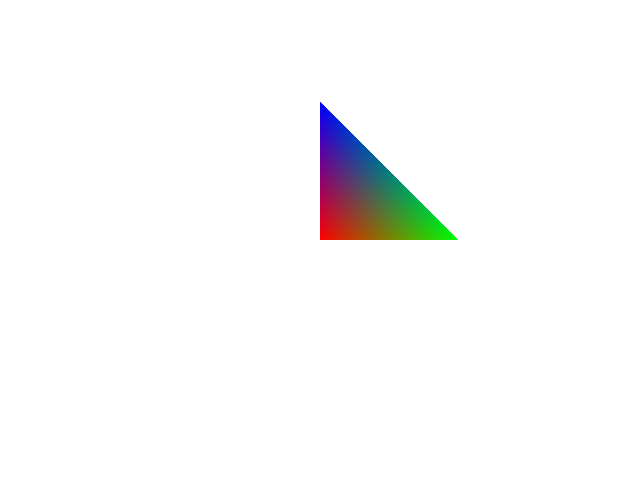

# Basic Graphics Pipeline

## Description
This test create a simple graphics pipeline and renders a triangle.
This is the most primitive graphics test. No backface culling,
no multisample, no depth/stencil buffer, etc.

## Reference

