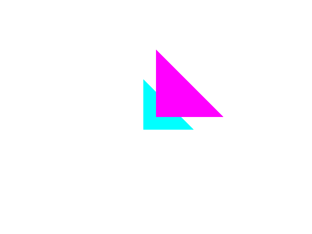

# Depth Test

## Description
This test creates two overlapping triangles.
The magenta one is in the front, while the cyan one is in the back.
The magenta one is drawn first, while the cyan one is drawn last.
If depth test is working as expected, we will see magenta triangle
covering the cyan triangle.

## Reference

